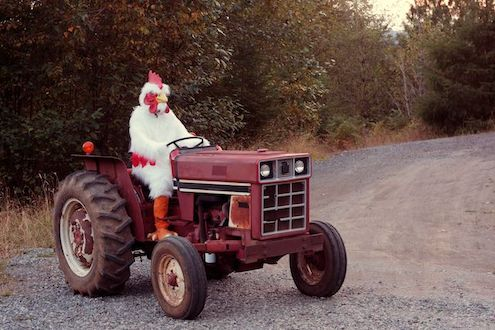

# Computer Vision Projects

This repository contains three Computer Vision Programs: An implementation of a Butterworth Lowpass Filter, An implementation of a Butterworth Lowpass Filter with a manual mask, and a scalar image resizing program.

## Technologies Used

- **Python:** The primary programming language used for developing the project.

  - [Python Official Website](https://www.python.org/)

  ### <u>Dependencies:</u>

  - **OpenCV (cv2):** Used for reading, resizing and writing images.
  - **NumPy:** A fundamental library for computing in Python. It also contains Fast Fourier Transform function that is pivotal in frequency analysis of images.
  - **Math:** The Python math module is used for mathematical operations and calculations.
  - **Matplotlib.pyplot:** A Python 2D plotting library used to display the frequency domain as a result of the Fourier Transformation of an image.

## I) Butterworth Lowpass Filter Implementations

### About the Butterworth Lowpass Filter

The Butterworth Lowpass Filter is an image processing technique that filters out high-frequency noise from an image. The filter is applied to a Fourier Transformation of an image to get obtain and organize the frequencies of the pixels in an image.

- **H(_u_, _v_)** is the filter result in the frequency domain.
- **D(_u_, _v_)** is the distance from the point (_u_, _v_) to the origin of the frequency plane.
- **D0** is the cutoff frequency that determines where the filter should start attenuating higher frequencies.
- **n** is the order the filter. This value dictates whether the filter will be applied with a steep cutoff or a smooth, rounded cutoff.

The Butterworth Lowpasss Filter is used when an image has high frequency sinusoidal noise present in the image. An advantage to this filter is the order of the filter can be changed to smooth out the frequency attenuation to reduce the ringing effect that is present in other filters such as the Ideal Lowpass Filter.

### A) **Butterworth Lowpass Filter**

Find the source code <a href="./ImageNoiseFilters/ButterworthLPF/ButterworthLPF.py">here</a>!

&nbsp;&nbsp;&nbsp;This program implements a Butterworth Lowpass Filter with no additional masks applied.

| Original Photo with Noise          | Fourier Transform with Noise        |
| ---------------------------------- | ----------------------------------- |
| [![Original Image][img1]][link1]   | [![Image 2][img2]][link2]           |
|          |     |

| Fourier Transform after filter      | Image after Filter                  |
| ----------------------------------  | ----------------------------------- |
| [![Image 3][img3]][link3]           | [![Image 4][img4]][link4]           |
| Fourier Transformation after filter | Final Result                        |

[img1]: ./ImageNoiseFilters/ButterworthLPF/Lena.jpg
[link1]: ./ImageNoiseFilters/ButterworthLPF/Lena.jpg
[img2]: ./ImageNoiseFilters/ButterworthLPF/noisyFFt.jpg
[link2]: ./ImageNoiseFilters/ButterworthLPF/noisyFFt.jpg
[img3]: ./ImageNoiseFilters/ButterworthLPF/FilteredFFT.jpg
[link3]: ./ImageNoiseFilters/ButterworthLPF/FilteredFFT.jpg
[img4]: ./ImageNoiseFilters/ButterworthLPF/Output.jpg
[link4]: ./ImageNoiseFilters/ButterworthLPF/Output.jpg

&nbsp;&nbsp; The result is an image that has lower contrast and lower sharpness. This is two be expected as the filter only passes the lower spectrum colors to pass. The filter cleans up the random white color noise present in the original image.

### B) **Butterworth Lowpass Filter with Manual Mask**
Find the source file <a href="./ImageNoiseFilters/ButterWorthLowPassFilterAndManualMask/ButtworthLPFandManualMask.py">here</a>!

&nbsp;&nbsp; This program extends the functionality of the Butterworth Lowpass Filter by incorporating a manual masking technique. This additional feature targets and filters out the specific noise components responsible for the periodic disturbances in the image. 

| Original Photo with Noise          | Fourier Transform with Noise        |
| ---------------------------------- | ----------------------------------- |
| [![Original Image][img5]][link5]   | [![Image 2][img6]][link6]           |
|          |     |

| Fourier Transform after filter      | Image after Filter                  |
| ----------------------------------  | ----------------------------------- |
| [![Image 3][img7]][link7]           | [![Image 4][img8]][link8]           |
| Fourier Transformation after filter | Final Result                        |

[img5]: ./ImageNoiseFilters/ButterWorthLowPassFilterAndManualMask/stripedWoman.jpg
[link5]: ./ImageNoiseFilters/ButterWorthLowPassFilterAndManualMask/stripedWoman.jpg
[img6]: ./ImageNoiseFilters/ButterWorthLowPassFilterAndManualMask/stripeFFt.jpg
[link6]: ./ImageNoiseFilters/ButterWorthLowPassFilterAndManualMask/stripeFFt.jpg
[img7]: ./ImageNoiseFilters/ButterWorthLowPassFilterAndManualMask/noSineFFT.jpg
[link7]: ./ImageNoiseFilters/ButterWorthLowPassFilterAndManualMask/noSineFFT.jpg
[img8]: ./ImageNoiseFilters/ButterWorthLowPassFilterAndManualMask/notStriped.jpg
[link8]: ./ImageNoiseFilters/ButterWorthLowPassFilterAndManualMask/stripedWoman.jpg

&nbsp; &nbsp; The image used in this program exhibits a significantly higher level of noise compared to the image used exclusively with the Butterworth Lowpass filter implementation. The presence of diagonal stripes in the image, which have consistent color values and spacing, is a clear indicator of periodic noise. This periodic noise is further confirmed by examining the Fourier Transform of the noisy image, revealing the presence of star-like patterns along parallel lines aligned with both the vertical and horizontal axes.

&nbsp; &nbsp;To address this issue, a manual masking technique was employed to eliminate these parallel lines after the filter was applied. Similar to the initial implementation of the filter, the Fourier Transform still displays a prominent white glow, signifying the presence of high-frequency components across the entire image.

&nbsp; &nbsp;Similar to the first program's output image, the resulting image does not have great contrast or sharpness. This is to be expected as the original image did contain an abundant amount of noise.

## II) Scalar Image Resizing with Resampling and  Bilinear Interpolation

Find the source code <a href="./ResizeImageWithInterpolation/ScalarResizing.py">here</a>!

&nbsp;&nbsp; Resampling is the technique of changing the spatial resolution of an image. This program makes an image larger which adds pixels to the final output.

&nbsp;&nbsp; Interpolation is the method of estimating the values of new pixels based on known values of surrounding pixels. In this implementation, bilinear interpolation is used. Bilinear interpolation uses the average of four surrounding pixels in the primary cardinal directions to estimate the new pixel value.

&nbsp;&nbsp; This program combines these two methods to read in an image and make the image larger by a scalar factor. In this implementation the scalar factor is 3.
- <u>**NOTE:**</u> The program is required to execute bilinear interpolation for each newly processed pixel. Consequently, the program's runtime complexity is O(m x n), where 'm' represents the number of pixels in the image's height, and 'n' represents the number of pixels in the image's width. Actual runtime will be determined by the hardware used to run the program.

<figure align="center">
     
    <figcaption>Original Image Size</figcaption>
</figure>

<figure align="center">
     
    <figcaption>Resized Image</figcaption>
</figure>

&nbsp;&nbsp; The outcome is an image that has been expanded to three times its original size, both in terms of height and width. As a consequence of this enlargement and the estimation of new pixel values, a reduction in resolution can be anticipated.

