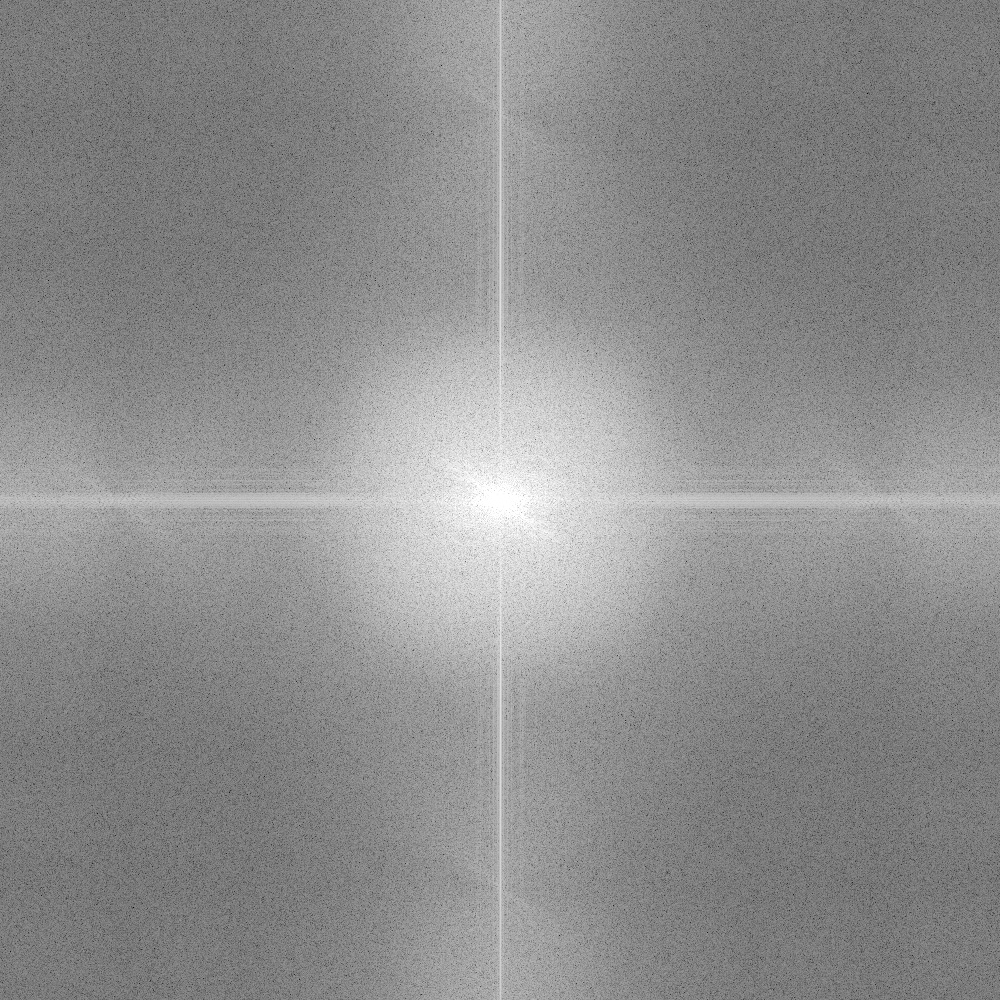
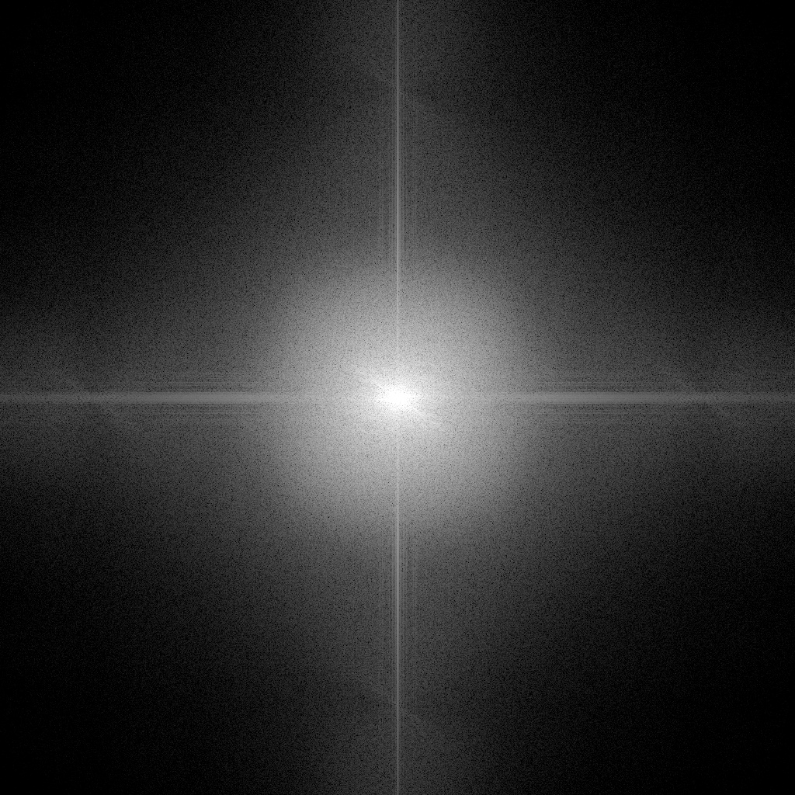
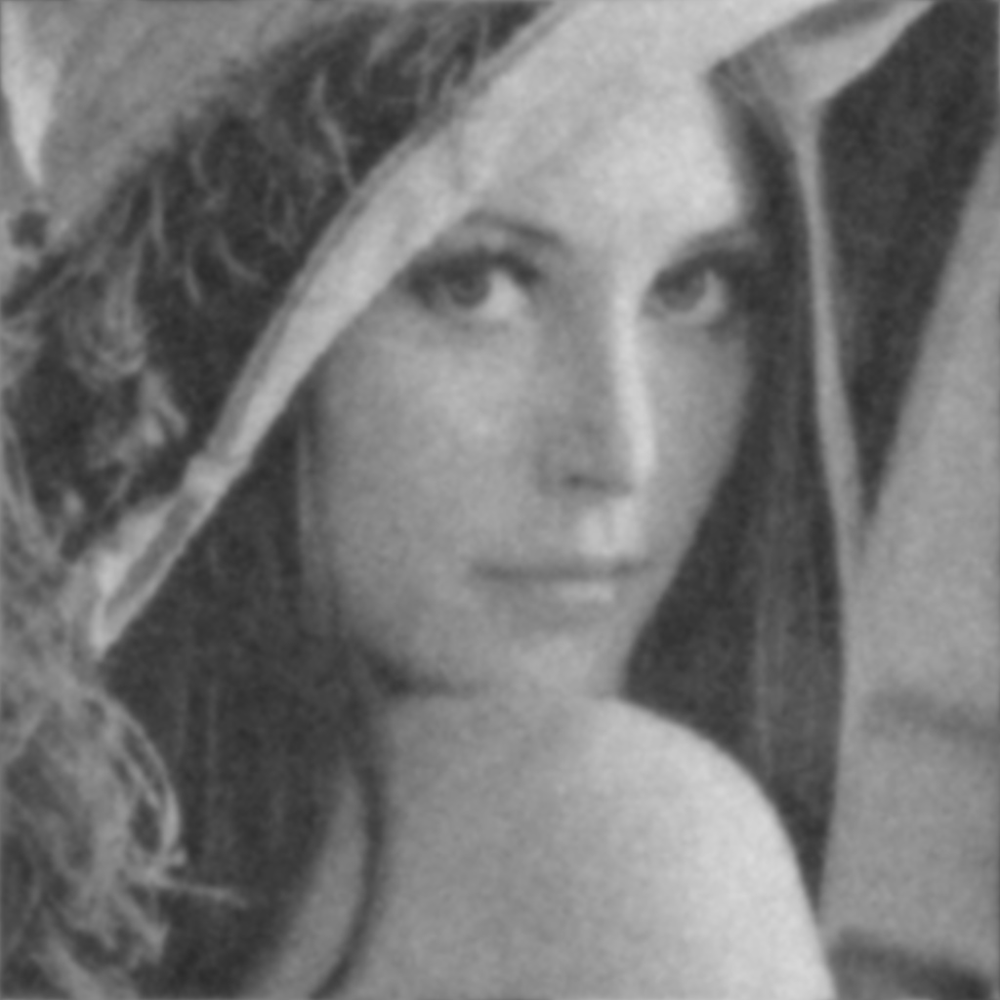

# Computer Vision Projects

This repository contains three Computer Vision Programs: An implementation of a Butterworth Lowpass Filter, An implementation of a Butterworth Lowpass Filter with a manual mask, and a scalar image resizing program.

## Technologies Used

- **Python:** The primary programming language used for developing the project.

  - [Python Official Website](https://www.python.org/)

  ### <u>Dependencies:</u>

  - **OpenCV (cv2):** Used for reading, resizing and writing images.
  - **NumPy:** A fundamental library for computing in Python. It also contains Fast Fourier Transform function that is pivotal in frequency analysis of images.
  - **Math:** The Python math module is used for mathematical operations and calculations.
  - **Matplotlib.pyplot:** A Python 2D plotting library used to display the frequency domain as a result of the Fourier Transformation of an image.

## I) Butterworth Lowpass Filter Implementations

### About the Butterworth Lowpass Filter

The Butterworth Lowpass Filter is an image processing technique that filters out high-frequency noise from an image. The filter is applied to a Fourier Transformation of an image to get obtain and organize the frequencies of the pixels in an image.

- **H(_u_, _v_)** is the filter result in the frequency domain.
- **D(_u_, _v_)** is the distance from the point (_u_, _v_) to the origin of the frequency plane.
- **D0** is the cutoff frequency that determines where the filter should start attenuating higher frequencies.
- **n** is the order the filter. This value dictates whether the filter will be applied with a steep cutoff or a smooth, rounded cutoff.

The Butterworth Lowpasss Filter is used when an image has high frequency sinusoidal noise present in the image. An advantage to this filter is the order of the filter can be changed to smooth out the frequency attenuation to reduce the ringing effect that is present in other filters such as the Ideal Lowpass Filter.

### A) **Butterworth Lowpass Filter**

Find the source code <a href="./ImageNoiseFilters/ButterworthLPF/ButterworthLPF.py">here</a>!  
 &nbsp;&nbsp;This program implements a Butterworth Lowpass Filter with no additional masks applied.

    

        <figurealign="center">
             
            <figcaption>Original Image with Noise</figcaption>
        </figure>
    

    

        <figure align="center">
             
            <figcaption>Fourier Transform before filter</figcaption>
        </figure>
    

    

        <figure align="center">
             
            <figcaption>Fourier Transformation after filter</figcaption>
        </figure>
    

    

        <figure align="center">
             
            <figcaption>Final Result</figcaption>
        <figure>
    

### B) **Butterworth Lowpass Filter with Manual Mask**

## II) Scalar Image Resizing with Interpolation
